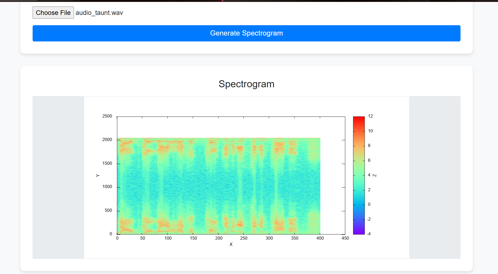
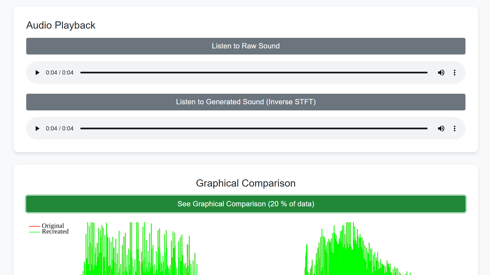

# STFT Generator and Visualizer

### Project for CS 6221 @ GWU

This project provides a GUI-based tool to generate the Short-Time Fourier Transform (STFT) for a given WAV audio file. It also supports visualization and basic audio processing functionalities, making it a comprehensive tool for signal analysis and exploration.

---

## Team Members
- **Alice Dragnea**
- **Taslim Mahbub**
- **Akshay Nayak**
- **Jacob Weber**

---

## Features

- **STFT Generation**: Generate and visualize the spectrogram for WAV audio files.
- **Inverse STFT**: Reconstruct audio from the STFT.
- **Line Chart Comparison**: Visualize the original and reconstructed signals for quality assessment.
- **GUI Interface**: A web-based interface for easy interaction.
- **Standalone Processing**: Perform audio operations without the GUI.

---

## Running the Project

1. **Launch the Web Server**:
   - Run the following command:
     ```bash
     go run .
     ```
   - This will launch the Gin web server.

2. **Access the GUI**:
   - Open your browser and navigate to:
     ```
     http://localhost:8080/
     ```

---

## Code Structure

- **Main Functionality**:
  - The GUI and server logic are in `main.go`.
  - Navigate to `http://localhost:8080/` to interact with the GUI.

- **Audio Processing**:
  - The audio processing logic resides in `ssp.go`. 
  - Key functions:
    - **`perform_stft_pipeline`**:
      - Generates and saves the spectrogram.
      - Performs inverse STFT.
      - Saves line charts and reconstructed audio files.
    - **`perform_stft_standalone`**:
      - Performs only the STFT operations without additional processing.

---

## External Dependencies

1. **GoSSP**:
   - Ensure you have the GoSSP library installed:
     [https://github.com/r9y9/gossp/tree/master](https://github.com/r9y9/gossp/tree/master)

2. **Gnuplot**:
   - Install Gnuplot for line chart visualization:
     [http://www.gnuplot.info/](http://www.gnuplot.info/)

---

## Branches

1. **`main`**:
   - Contains the GUI web server and the integrated STFT processing code.

2. **`mfcc-experiments`**:
   - Extends the audio processing pipeline by adding MFCC functionality on top of STFT.

3. **`jacob-STFT`**:
   - An earlier branch focused on STFT development (now fully integrated into `main`).

---

## To-Do List

1. Extend the pipeline to include:
   - MFCC generation.
   - Inverse MFCC for audio reconstruction.

2. Improve file compatibility:
   - Support for non-header WAV files.
   - Process other audio file formats.

3. Enhance functionality:
   - Correctly handle stereo tracks.

---

## License

This project is shared for educational purposes and is part of CS 6221 coursework at GWU. Contributions and feedback are welcome.

---

### Screenshots




---
